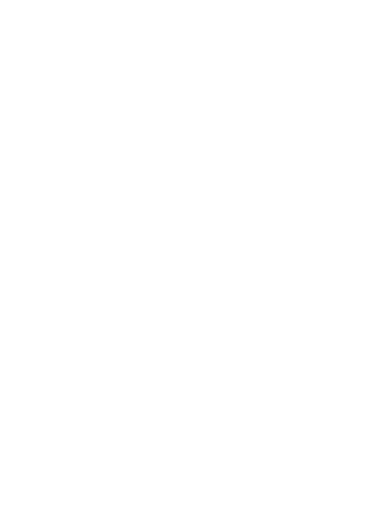

<h2>
RICardo  commerce international au XIXe siècle

</h2>

Comment renouveler l’histoire de la mondialisation commerciale
grâce au numérique ?    Séminaire TransNum - Sciences Po 25/09/2020

 

Béatrice Dedinger - CHSP 
Paul Girard [@paulanomalie](https://twitter.com/paulanomalie) - OuestWare 

[<!-- .element: style="height: 80px;"-->](http://chsp.sciencespo.fr)
[<!-- .element: style="height: 50px;"-->](https://ouestware.com)

---

## Le projet RICardo

### Objectifs
1. Construction de base historique de données commerciales bilatérales sur la période c.1800-1938
2. Renouveler l'état de nos connaissances sur la mondialisation commerciale aux 19e-20e siècles

### Méthodes

Modèle de gravité puis exploration visuelle des données

---
1. Richesse et complexité des données RICardo
2. La démarche de l'exploration visuelle
3. Analyser la mondialisation dans toute sa complexité 
---
## 
<!-- .element: style="margin:0" -->

---
## 
<!-- .element: style="width:50%" -->

---
# **Les entités RICardo**

- entités commerçantes telles que mentionnées dans les sources
- quelque soit leur "statut"
---

*France. Tableau décennal du commerce, 1847-1856*

<!-- .element: style="width:200%;" -->

---

*Sveriges officiela statistik. Utrikes handel och sjöfart. 1873*

<!-- .element: style="" -->

---
## **L’hétérogénéité des entités RICardo**

---
## GeoPolHist : Geopolitical entities

---
## GeoPolHist : Geopolitical status in time

---
[<!-- .element: style="margin-top:-50px" -->](https://medialab.github.io/GeoPolHist/#/GeoPolHist/country/900)

---

# IV. network analysis

---

<section data-background-image="./img/network_1878.png">
</section>

Note:

- asymetric link weight
- inclusion links
