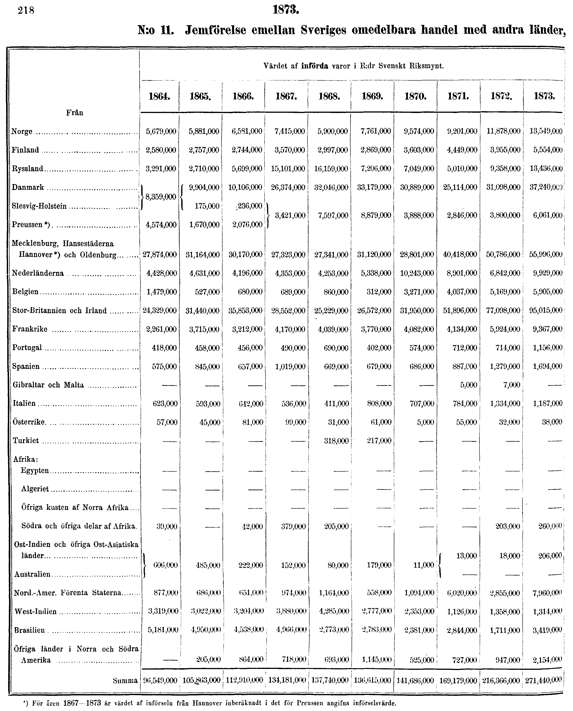
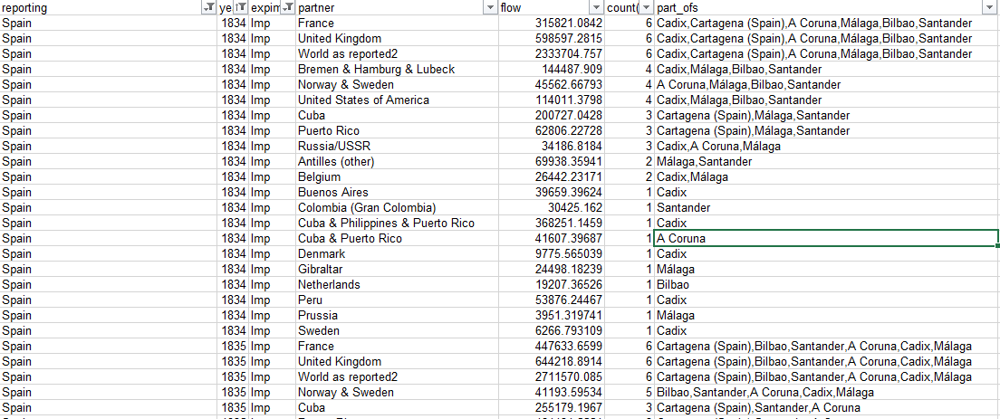
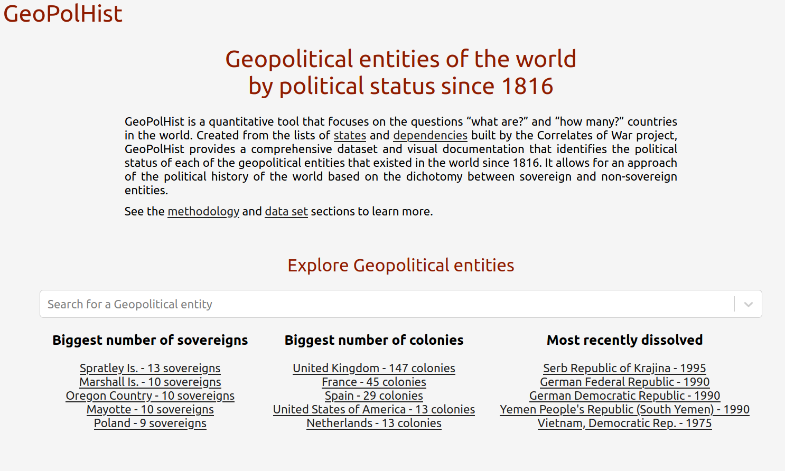
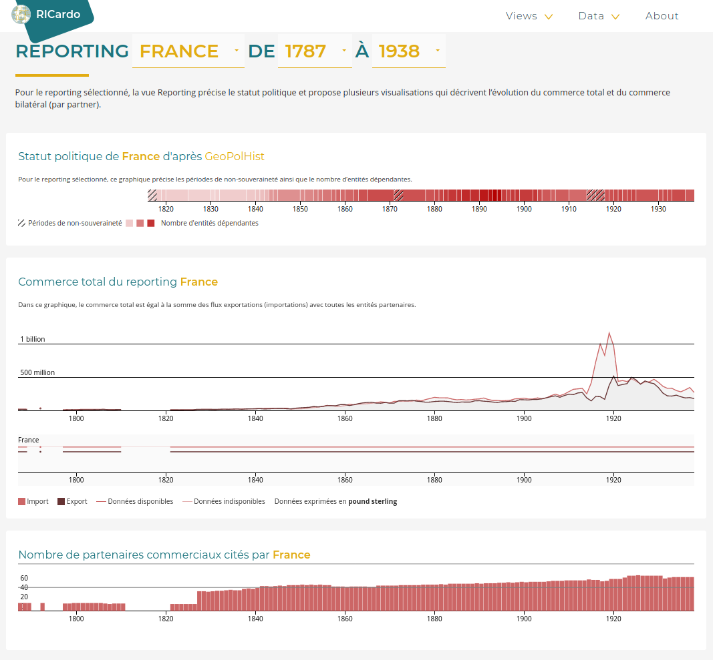
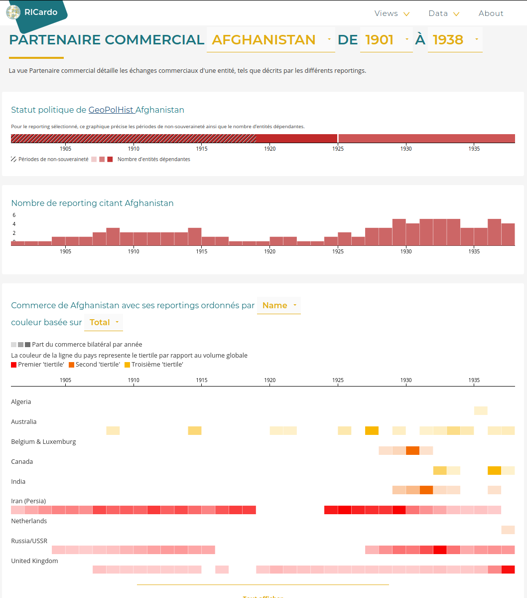
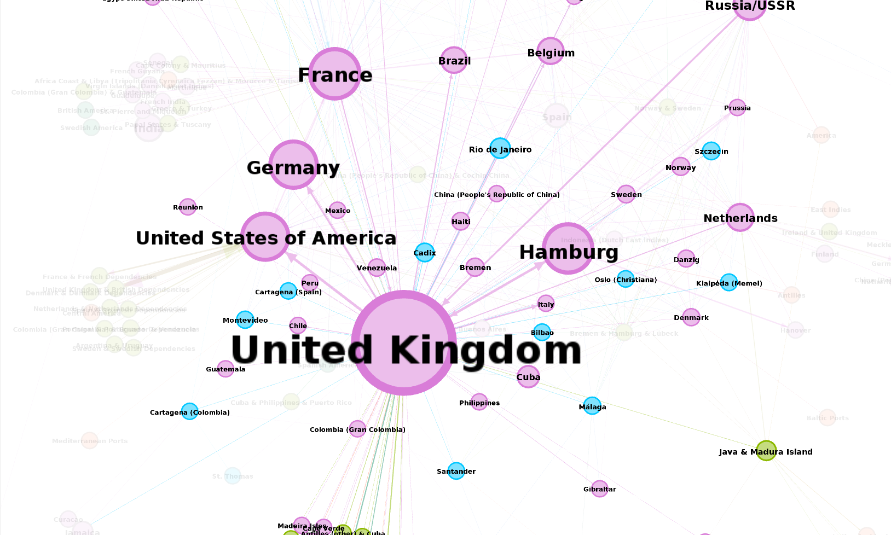
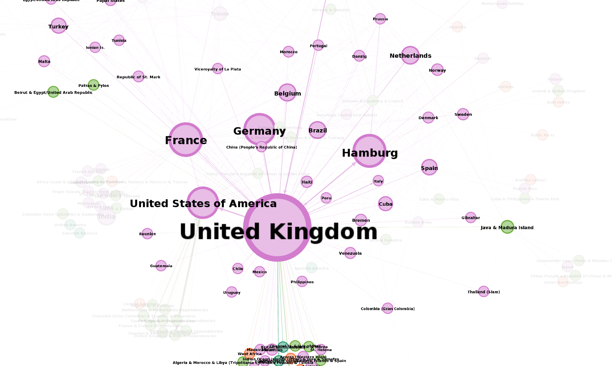
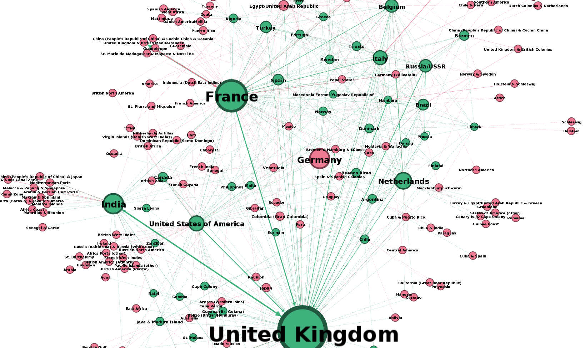
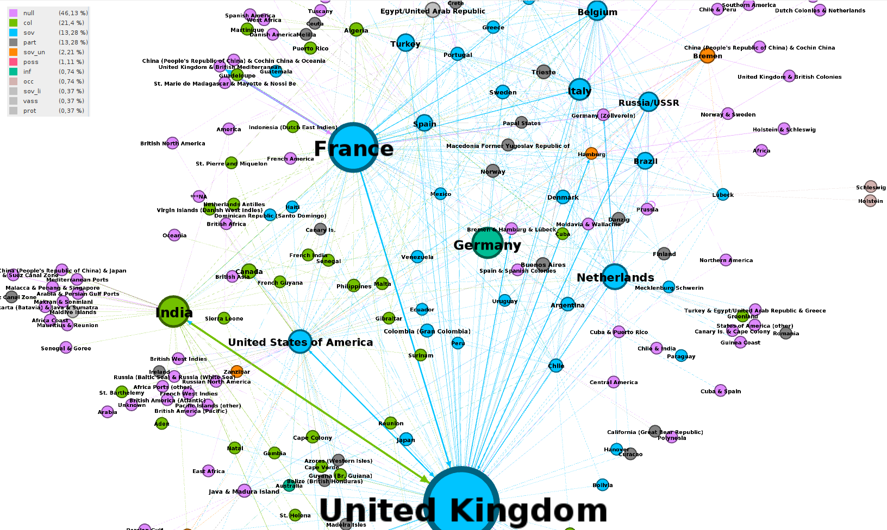

<h2 style="margin-bottom:0px !important">
RICardo
</h2>
<h3 >
Commerce international aux XIX-XXe siècles

</h3>

Comment renouveler l’histoire de la mondialisation commerciale
grâce au numérique ?   <i>Séminaire TransNum - Sciences Po</i> 25 septembre 2020

 

Béatrice Dedinger - CHSP 
Paul Girard [@paulanomalie](https://twitter.com/paulanomalie) - OuestWare 

[<!-- .element: style="height: 80px;"-->](http://chsp.sciencespo.fr)
[<!-- .element: style="height: 50px;"-->](https://ouestware.com)

---

## Le projet RICardo

**Objectifs** :
1. Construction de base historique de données commerciales bilatérales sur la période c.1800-1938
2. Renouveler l'état de nos connaissances sur la mondialisation commerciale aux 19e-20e siècles

**Méthodes** :  
Modèle de gravité puis exploration visuelle des données

---
1. Richesse et complexité des données RICardo
2. Exploration visuelle de la mondialisation commerciale 
---
## Les flux de la base RICardo
---
## 
<!-- .element: style="margin:0" -->

---
## Les entités RICardo

---

*France. Tableau décennal du commerce, 1847-1856*

<!-- .element: style="width:200%;" -->

---

*Sveriges officiela statistik. Utrikes handel och sjöfart. 1873*

<!-- .element: style="" -->

---
## **L’hétérogénéité des entités RICardo**

---

## Le type 'Geopolitical entity'

---
## Entités 'part of' Spain 1834-35

---

---
## GeoPolHist: political status

---
## GeoPolHist: political status in time

---
[<!-- .element: style="margin-top:-50px" -->](https://medialab.github.io/GeoPolHist/#/GeoPolHist/country/900)

---
## Exploration visuelle du commerce mondial des XX-XIXe siècles
---

## L'importance de Reporting / Partner 
---

---

---
## Exploration des structures commerciales

---

## 1. Construire le réseaux des flux

*Noeud : Converger vers le niveau entité*:
- agréger les flux part of 
- désagrégation les flux groupes

*Lien : accorder les vues bilatérales*
- choisir une méthode pour réduire les doublons bilatéraux (GTAP)

<small>*Girard, Paul, et Beatrice Dedinger. RICardo World Trade Web, 1834-1938. http://spire.sciencespo.fr/hdl:/2441/6h7io1v56e8k4qtht2cuvjcfa5. Department of economic history research seminar, Lunds universitet, Lund, SE.
*</small>

---

**1834 : en bleu, les "city/part of" dont des villes espagnoles.**

---
**1834 : Les villes espagnoles ont été agrégées à l'entité "Spain".**

---
## 2. Contextualiser

Le réseau est un objet mathématique pratique.  
Comme toute abstraction il réduit la multitude.  
Derrière un nœud se cache de multiples réalités.  
Maintenir la complexité dans l'interprétation de ces images.

---

Garder la richesse des sources en contextualisant les entités commerçantes :
- indiquer les effets de construction
- indiquer les statuts politiques 
- prendre en compte la dimension géographique

---
**1865 : Vert = Reporting, Rouge = seulement Partner**

---
**1865 : couleur = GPH status (voir légende)**

---

réseau avec positionnement géographique ?

Notes : Je n'aurai probablement pas le temps de faire ça.

---

## Effet du numérique ? 

**L'exploration visuelle comme méthode de recherche**

Un autre rapport aux données.  
Un terrain d'enquête plus qu'un seul moyen de calcul.  

<small>*Arènes, Alexandra, et Paul Girard. « Dialogue sur la visualisation ». Sciences Po médialab, 19 mars 2020, https://medialab.sciencespo.fr/actu/dialogue-sur-la-visualisation/.
*</small>

---

## Autre effet du numérique ?

**Open Science**

Mise en réseau : facilite publications et usages secondaires.  
Intérêt plus fort à créer et partager des jeux de données.

---

<section data-background-image="./img/network_1878.png">
</section>

Note:

- asymetric link weight
- inclusion links
