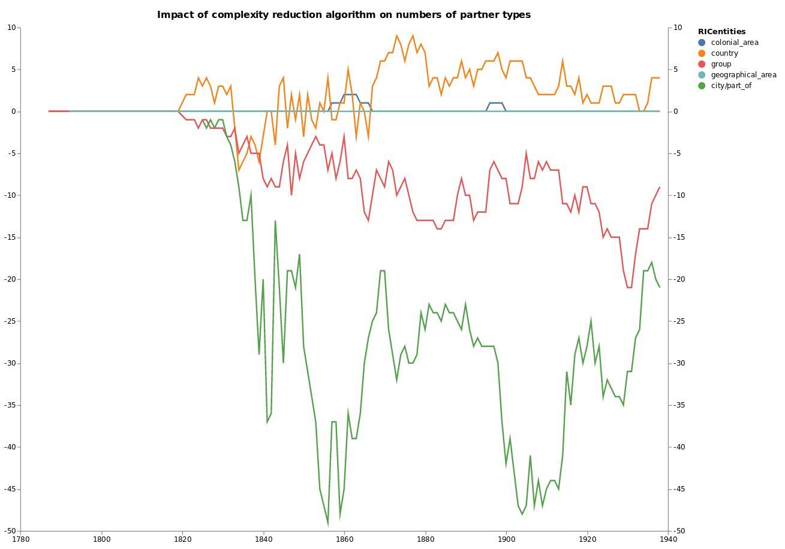

<h2>
RICardo World Trade Web, 1834-1938

</h2>

Department of Economic History   Lund University research seminar - 10/10/2018

 

Paul Girard [@paulanomalie](https://twitter.com/paulanomalie) 
Béatrice Dedinger 

[<!-- .element: style="height: 150px;"-->](http://medialab.sciencespo.fr)
[<!-- .element: style="height: 150px;margin-left:200px;"-->](http://chsp.sciencespo.fr)

---

# Homogeneization
#    ≠
# cleaning

---

- convergence of entity names and type
- coding metadata (Imp/Exp, general/special...)
- exchange rates to £ sterling (current price)

=> to build a common structure for the source data
---

---
# I. heterogeneity
---
## 1. RICentities
---

---
### Top 20 (in value) only-partner countries 

---
### Quantifying the issue

---

## 2. mirror flows discrepencies
---

<!-- .element: style="width:50%" -->

---

---
### Quantifying the issue

<!-- .element: style="width:70%" -->

---

# II. variability in time

---
## number of reporting through time
<!-- .element: style="width:100%" -->

---
## number of flows though time

---

---
# III. Reducing complexity
---
## Groups desaggregation   direct method

---
## Groups desaggregation   mirror method

---
## City part ofs

- group 'city/part of' flows by reporting, year, expimp, country_part_of
- sum the flow values
- create a new flow to the partner "country_part_of"
- delete the original flows
- delete generated flows when duplicates of existing ones from source

---
## Quality tags

Generated flows are tagged, indicating the method used :

- group_desaggregation_direct_diffYear
- group_desaggregation_mirror_diffYear
- city_part_of_partner_aggregation

---
## Colonial areas

- for each colonial areas
- to manually define the composition
- by selecting the possible colonies listing in COW dataset
- the composition variations through time will be done automatically
- transform the colonial areas into groups

---
# IV. Quality measures
---

<!-- .element: style="margin:0px;width:90%"-->

---

---

---
#  IV. network analysis
---
<section data-background-image="./img/network_1878.png">
</section>

Note:
- asymetric link weight
- inclusion links

