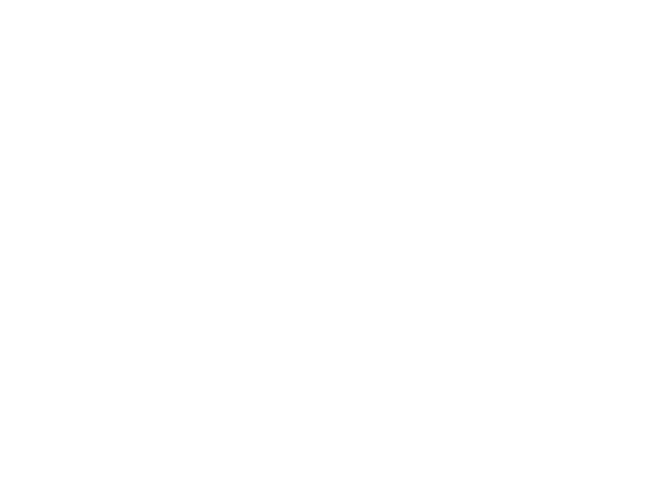
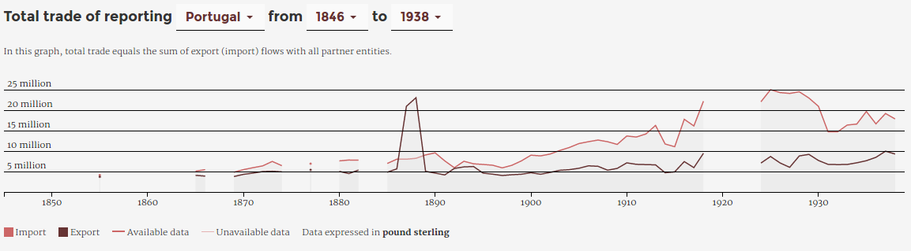
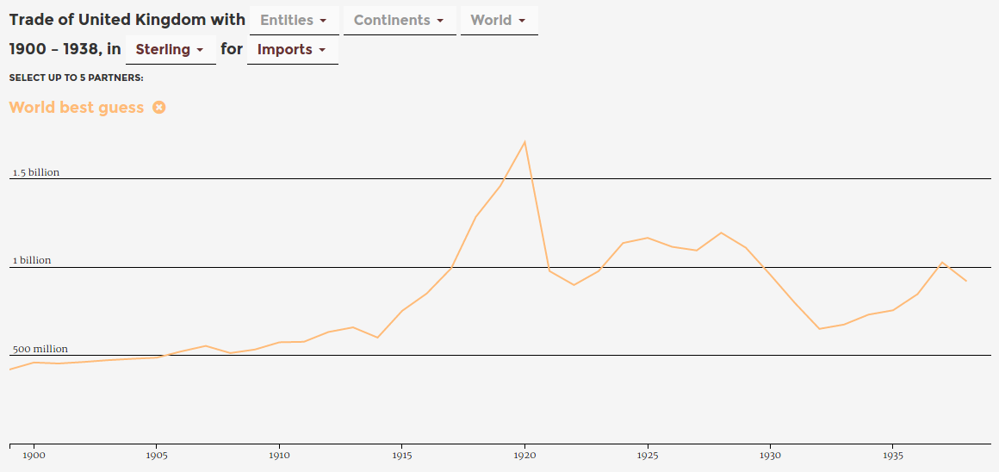
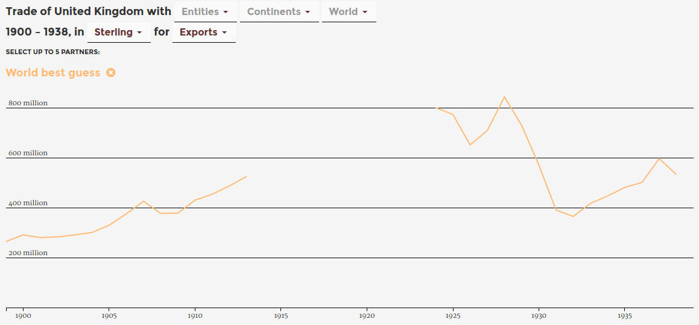
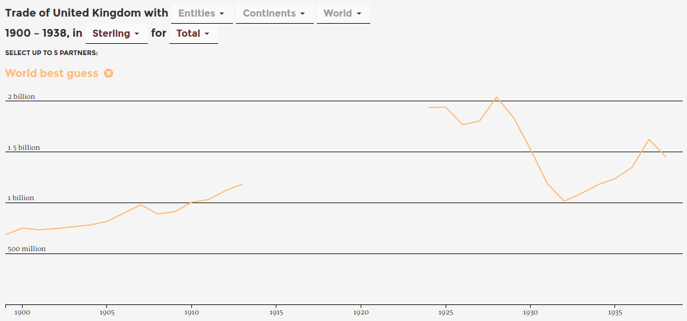
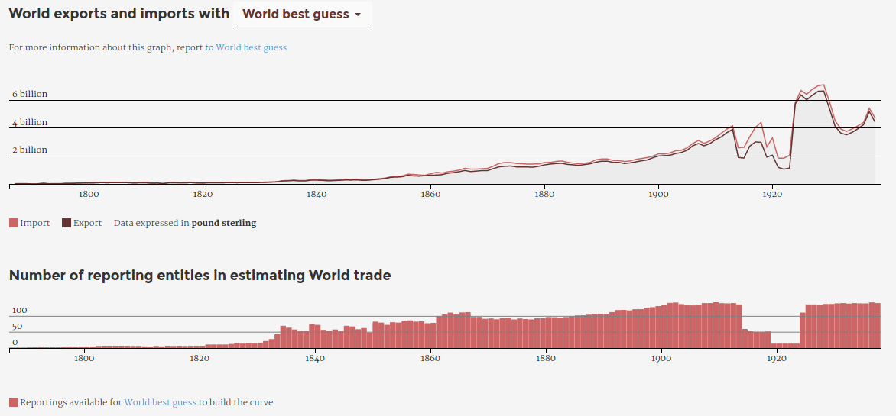
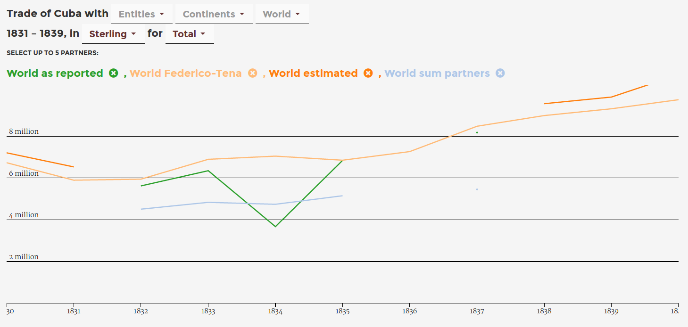
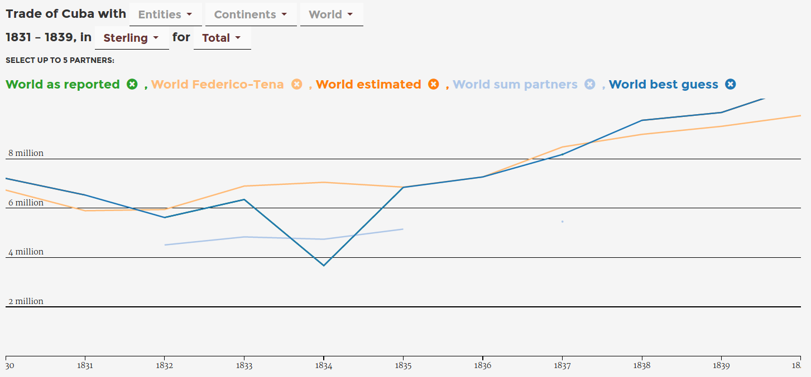
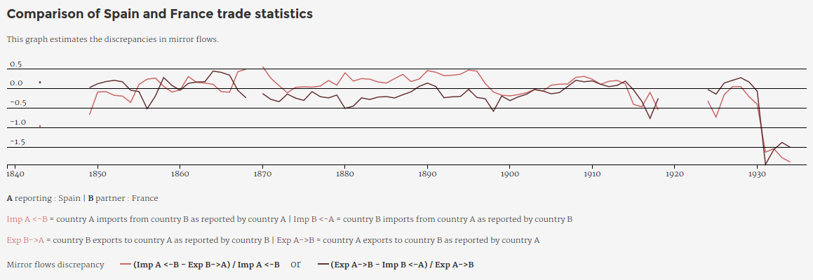

# RICardo Project : Exploring 19th Century International Trade
 
Paul Girard, Beatrice Dedinger, Donato Ricci,  
Benjamin Ooghe-Tabanou, Mathieu Jacomy,  
Guillaume Plique, Gregory Tible.

---

# RICardo database
<small>**Dedinger, B. and Girard, P.** (2016). Exploring trade globalization in the long run : the RICardo project. *Historical Methods* http://ricardo.medialab.Sciences-po.fr/Dedinger_Girard_RICardo_HistoricalMethods.pdf. (to be published)</small>

# RICardo web application
[http://ricardo.medialab.sciences-po.fr](http://ricardo.medialab.sciences-po.fr)

---
# the 19th century

year by year  
1787 ⋅ ⋅ ⋅ ⋅ ⋅ ⋅ ⋅ ⋅ ⋅ ⋅ ⋅ ⋅ 1938

---
# Bilateral trade

Trade flows between ~~countries~~ entities  
A <⋅⋅> B

---
# Bilateral trade
<!-- .element: style="width:50%"-->
Note:bilateral trade data model

---
# Total trade

Trade flows between entity A and the world  
A <⋅⋅> W

---
# Primary sources

Primary sources are compilations of customs returns published by national agencies.

---
# Primary sources - Top 7 on 19

|||
|-|-|
|Annual Statement of Trade of the United Kingdom with Foreign countries and British possessions|United Kingdom|
|Foreign Commerce and Navigation of the United States|United States of America|
|Statistique de la Belgique. Tableau général du Commerce avec le pays étrangers|Belgium|
|Tableau décennal du commerce de la France avec ses colonies et les puissances étrangères|France|
|Estadística general del comercio exterior de España|Spain|
|Statistiek van den Handel en de Scheepvaart in het Koninkrijk der Nederlanden|Netherlands|
|Sveriges officiella statistik. F.Utrikeshandel och sjöfart. Kommerskollegii underdåniga berättesle|Sweden|

---
# Secondary sources

Secondary sources include international compilations of trade primary sources or national compilations of national statistics that include foreign trade statistics (mainly statistical yearbooks).

---
# Secondary sources - Top 5 on 26
|||
|-|-|
|Statistical Abstract for the British Empire|Barbados,Guyana (Br. Guiana),Cape Colony,Sri Lanka (Ceylon),Canada,...|
|Statistical Abstract for the principal and other Foreign Countries|Argentina,Austria-Hungary,Bulgaria,...|
|Statistiques du commerce extérieur, Société des Nations|Albania,Algeria,Brazil,Sri Lanka (Ceylon),Chile,...|
|Annales du commerce extérieur. Faits commerciaux. 3e série Avis divers, Ministère de l'Agriculture, du Commerce et des Travaux Publics|Spain,Greece,Italy,Portugal,Turkey,...|
|Statistical Abstract of the United States|United States of America|

---
# Estimation sources

‘Estimation’ sources are works that only provide total trade data.

---
# Estimation sources - Top 8 on 28

|||
|-|-|
|International Historical Statistics, Mitchell, 2007|Ivory Coast,Turkey,Algeria,...|
|Statistical Abstract of Foreign Countries, Department of commerce and labor, 1909|Argentina,Austria-Hungary,...|
|Historical Statistics of the United States, Carter et al, 2006|United States of America|
|British Historical Statistics, Mitchell, 2011|United Kingdom|
|New series of the Spanish foreign sector 1850-2000, Tena-Junguito, 2007|Spain|
|Portuguese Historical Statistics, Valério, 2001|Portugal|
|Dutch GDP and its Components 1800-1913, Smits et al., 2000|Netherlands|
|Deutschlands Aussenhandel 1815-1870, Bondi, 1958|Germany|

---
# Currencies - Top 20 on 120

|||
|-|-|
|sterling pound|indian rupee|
|us dollar|italian lira|
|french franc|japanese yen|
|belgian franc|danish krone|
|netherlands guilder|swiss franc|
|german mark|philippine peso (peso fuerte)|
|spanish peseta|finnish markka|
|swedish krone|norwegian krone|
|russian ruble|chinese haikwan tael|
|chilean peso|uruguayan peso|

---
# Exchange rates to £ (excerpt)
|year|currency|rate to £|source|
|-|-|-|-|
|1848|us dollar|4.87|Currency_Denzel (2010), 417-420.|
|1920|belgian franc|48.8042947779|Currency_Schneider et al. (1997), vol II, p. 35.|
|1817|french franc|24.409|Currency_From Denzel (2010), 285-289.|
|1896|netherlands guilder|12.105|Currency_Denzel (2010), 69-72.|
|1885|german mark|20.406|Currency_Denzel (2010), 243-244.|
|1815|spanish peseta|22.3690189088|Currency_Schneider et al (1991), vol I, II, London on Madrid, 3 months, pp. 43-46|

---
# Entities heterogeneity

|Entity|Type|
|-|-|
|European Russia|city/part_of|
|British South Africa|colonial_area|
|Kenya (British East Africa Protectorate) & Uganda|group|
|Rio de Janeiro|city/part_of|
|French West Africa & Togo (French Togoland)|group|
|Java & Madura Island|group|
|Syria & Lebanon|group|
|Alexandria|city/part_of|

---

---
# data flow

~~MS Access~~

CSV files + python scripts = sqlite  

version control system for CSV files 
    
Complete dataset to be released on github in 2017

---
<!-- .slide: data-background-image="img/github_data.png"-->

---
<!-- .slide: data-background-image="img/internetarchive_statisticalabstract.png"-->
<a href="https://archive.org/stream/statisticalabstr2318grea#page/166/mode/2up" target="_blank" style="background:black; padding:20px">Statistical abstract, P. 166 @ Internet Archive</a>

---
# RICardo database volumetry

- 294,138 flows
- 1,492 RICentities
- 152 years
- 120 currencies
- 7,206 exchange rates to £
- 73 source types (919 volumes)

---
# Exploratory Data Analysis

« The greatest value of a picture is when it
forces us to notice what we never expected to
see. »  
John W. Tukey
  
<small>**Tukey, J. W.** (1977). *Exploratory Data Analysis*. Addison-Wesley Publishing Company.</small>

---
# Exploring complexity through a datascape

- Dedicated interactive data visualisations
- Propose different focus on the database
- Handle complexity through dynamic exploration
  

<small>**Leclercq, C. and Girard, P.** (2013). *The Experiments in Art and Technology Datascape*. Collections Électroniques de l’INHA. Actes de Colloques et Livres En Ligne de l’Institut National D’histoire de L’art. INHA http://inha.revues.org/4926 (accessed 27 October 2015). </small>

---
# Building a datascape

Workshop called *«data sprints»* with:

- historians
- economists 
- developers
- designers

Addressing **content**, **implementation** and **design** issues  
 at the same time, in the same place. 

---
# How to explore complexity ? 

*Three progressive focus:*

**World** > **Country** > **Bilateral**  

*one visual documentation:*

**Metadata**

---
# Visualizing historical data issues

- How to inform about *data discrepancies* ?
- How to aggregate *incomplete datasets* ?
- How to deal with *data alternatives* ?
- How to deal with *data heterogeneity* ?

---
#How to inform about data discrepancies ?
*the metadata view*

---
<!-- .slide: data-background-image="img/metadata_view.png"-->
<a href="http://ricardo.medialab.sciences-po.fr/#/metadata" target="_blank" style="background: black; padding:20px">the metadata view</a>

---
# How to aggregate incomplete datasets ?
*different ways of handling null values*

---

<!-- .slide: data-transition="none"-->
# 0 ≠ null
  
   

^ oups !  <!-- .element: class="fragment" data-fragment-index="1"-->  

---
<!-- .slide: data-transition="none"-->
# 0 ≠ null
  
  
\- better -

---
<!-- .slide: data-transition="none"-->
#123 + null = null

United Kingdom, total trade **imports**, 1900-1938

---

<!-- .slide: data-transition="none"-->
#123 + null = null

United Kingdom, total trade **exports**, 1900-1938  
**Missing values in 1914-1923 period**

---

<!-- .slide: data-transition="none"-->
#123 + null = null

United Kingdom, total trade **total**, 1900-1938  
**Missing exports implies missing total in 1914-1923 period**

---
#123 + null + 411 = 534 (2/3)

Reveal number of available data points   
to contextualize agregation of partial data

---
# How to deal with *data alternatives* ?

*How the world trade evolves through the 19th century ?* 

Combining three ways to estimate total trade : 

1. recent estimations
2. reported totals
3. sum of partner flows

= WorldBestGuess flows

---
<!-- .slide: data-transition="none"-->
# Cuba Total trade variations

---
<!-- .slide: data-transition="none"-->
# Cuba Total trade Best Guess

---
# How to deal with *data alternatives* ?
<!-- .element: style="width:50%"-->

---
# Bilateral discrepancy indicator

<small>**Dedinger, B.** (2012). The Franco-German trade puzzle: an analysis of the economic consequences of the Franco-Prussian war1: THE FRANCO-GERMAN TRADE PUZZLE. *The Economic History Review*, 65(3): 1029–54 doi:10.1111/j.1468-0289.2011.00604.x.</small>

---
# How to deal with data heterogeneity ?
*taking the example of entities*

---
<!-- .slide: data-background-image="img/partners_heterogeneity.png"-->

---
# What about Prussia, Zollverein and Germany ? 

---
# Visual Exploratory Data Analysis to

- disseminate the database value
- easily explore its complexity
- produce precise time series
- help the everlasting data cleaning process

---

# Produce your own understanding of 19th century World trade

<a href="http://ricardo.medialab.sciences-po.fr" target="_blank">http://ricardo.medialab.sciences-po.fr</a>

---
# Open Science

- download related papers from home page
- download the visualizations' datasets in csv
- complete dataset to be released in 2017
- source code: [github.com/medialab/ricardo](http://github.com/medialab/ricardo)
- this presentation: [http://medialab.github.io/ricardo](http://medialab.github.io/ricardo)       
   
# Thank you for your attention
  
Paul Girard - paul.girard@sciencespo.fr - @paulanomalie